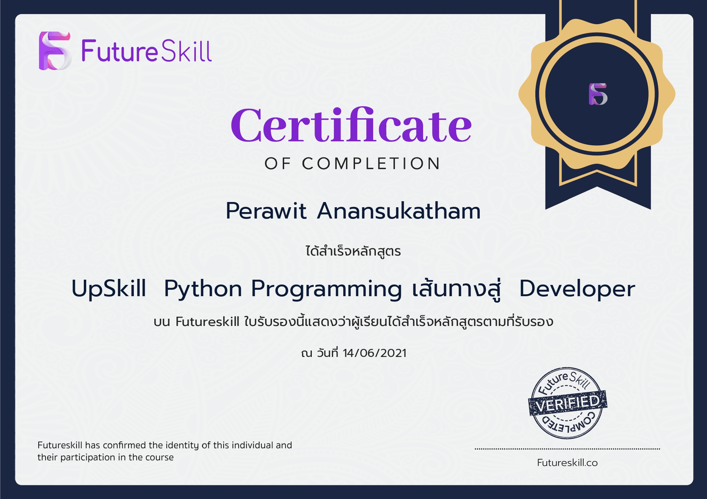

# Hi , I'm P 👋

## 📞 My contact :

    
    
    
    
    

 

## 🔧 Languages and Tools :

   

 

 

## 🎓 My Certificate :

    
    
    
    
    

 

## 💼 My Experience :

    
    
    
    
    
    
    
    
    
    
    
    

 

## 📈 My GitHub stats :

<!--  -->
  
  

<!--
**prwthub/prwthub** is a ✨ _special_ ✨ repository because its `README.md` (this file) appears on your GitHub profile.

Here are some ideas to get you started:

- 🔭 I’m currently working on ...
- 🌱 I’m currently learning ...
- 👯 I’m looking to collaborate on ...
- 🤔 I’m looking for help with ...
- 💬 Ask me about ...
- 📫 How to reach me: ...
- 😄 Pronouns: ...
- ⚡ Fun fact: ...
-->
